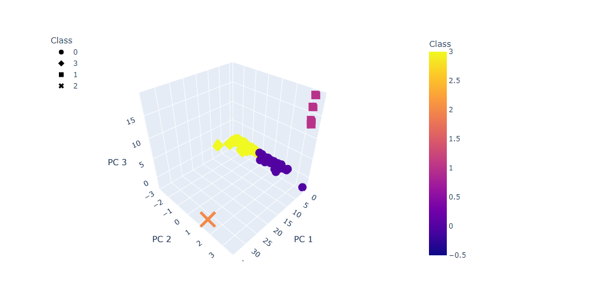

# Crypto_Clustering

## Analysis Overview

This project is to use unsupervised machine learning to analyze a database of cryptocurrencies and create a report including the traded cryptocurrencies classified by group according to their features.This classification report could be used by an investment bank to propose a new cryptocurrency investment portfolio to its clients.

After the processing of the data and cleaning it I ended up with 532 tradable cryptocurrencies

## Clustering Cryptocurrencies using K-Means - Elbow Curve

The best value is 4 for the k-means

## Visualizing the Cryptocurrencies Results for the board

### 3-D Scatter plot 

This plot was obtained using the PCA algoritham to reduce cryptocurrency dimensions.

### Tradable Cryptocurrencies Table

### 2D-Scatter plot with TotalCoinMined vs TotalCoinSupply

Plotting the scatter plot from two cryptocurrency features directly does not efficiently segregate the different classes. Then using the PCA algorithm is the right method for better visualizations.

# Summary 

We have identified 532 cryptocurrencies based on their similarirties in their futures. For the bank's clients the particularities need to analyzed for each group to determine their performance
